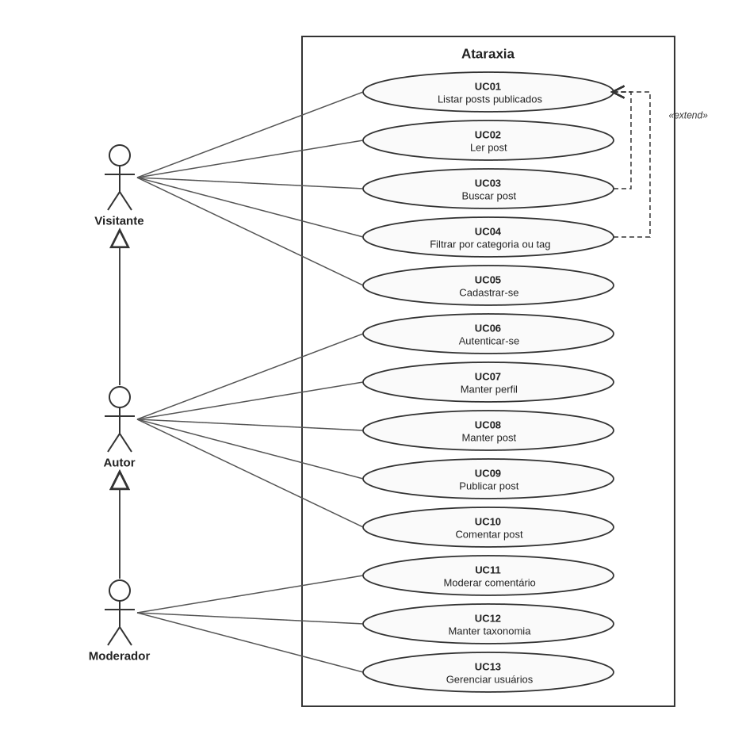

# Casos de uso

## Atores

**Tabela 5 — Atores**

| Ator | Descrição |
| ---- | --------- |
| Visitante | Qualquer pessoa que acessa o site sem estar autenticada |
| Autor | Usuário cadastrado e autenticado, que escreve e publica textos |
| Moderador | Usuário com permissão para moderar comentários, taxonomia e usuários |

Os atores se relacionam por generalização: o autor faz tudo o que o visitante
faz, e o moderador tudo o que o autor faz.

```
Visitante  ◁──  Autor  ◁──  Moderador
```

## Diagrama



**Figura 1 — Diagrama de casos de uso**

## Lista de casos de uso

**Tabela 6 — Casos de uso**

| ID | Caso de uso | Ator de origem | Aplicação |
| -- | ----------- | -------------- | --------- |
| UC01 | Listar posts publicados | Visitante | `posts` |
| UC02 | Ler post | Visitante | `posts` |
| UC03 | Buscar post | Visitante | `posts` |
| UC04 | Filtrar por categoria ou tag | Visitante | `taxonomy` |
| UC05 | Cadastrar-se | Visitante | `accounts` |
| UC06 | Autenticar-se | Autor | `accounts` |
| UC07 | Manter perfil | Autor | `accounts` |
| UC08 | Manter post | Autor | `posts` |
| UC09 | Publicar post | Autor | `posts` |
| UC10 | Comentar post | Autor | `comments` |
| UC11 | Moderar comentário | Moderador | `comments` |
| UC12 | Manter taxonomia | Moderador | `taxonomy` |
| UC13 | Gerenciar usuários | Moderador | `accounts` |

O verbo **manter** designa criar, ler, atualizar e excluir.

## Relacionamentos

UC03 e UC04 estendem UC01: são formas de restringir a listagem, e a listagem
funciona sem elas.

As demais são associações diretas entre ator e caso de uso.

Autenticar-se (UC06) é pré-condição de vários casos de uso, e não um caso
incluído por eles. Um `<<include>>` de UC06 em cada caso de uso do autor
poluiria o diagrama sem acrescentar informação.

## Ciclos de estado

```
Post:     DRAFT ──publicar──▶ PUBLISHED ──despublicar──▶ DRAFT

Comment:  criado ──▶ approved = True ──moderador──▶ approved = False
```

Comentário nasce aprovado e é retirado do ar pela moderação, não o contrário.
A escolha é deliberada: moderação prévia exigiria alguém de plantão para que o
site parecesse vivo.

## Casos de uso principais

Cinco casos de uso são descritos em detalhe a seguir. Juntos cobrem a jornada
completa do usuário: ler, navegar, cadastrar-se, escrever e comentar. Cada um
pertence a uma aplicação diferente, e é descrito por quem vai construí-la.

**Tabela 7 — Responsáveis pela descrição detalhada**

| Caso de uso | Aplicação | Responsável |
| ----------- | --------- | ----------- |
| UC02 — Ler post | `posts` | Rafaela |
| UC04 — Filtrar por categoria ou tag | `taxonomy` | Pedro |
| UC05 — Cadastrar-se | `accounts` | Renan |
| UC08 — Manter post | `posts` | Pedro |
| UC10 — Comentar post | `comments` | Gabriel |
