## accounts

```mermaid
classDiagram
    class User {
        <<Model do Django>>
        +CharField username
        +EmailField email
        +CharField password
        +check_password()
    }
    class Profile {
        <<Model>>
        +OneToOneField user
        +CharField display_name
        +TextField bio
        +get_absolute_url()
        +__str__()
    }
    class SignUpForm {
        <<Form>>
        +CharField username
        +EmailField email
        +CharField password1
        +CharField password2
        +clean_email()
        +save()
    }
    class SignUpView {
        <<View>>
        +form_class
        +template_name
        +form_valid()
        +get_success_url()
    }
    class ProfileUpdateView {
        <<View>>
        +model
        +fields
        +get_object()
    }

    User "1" -- "1" Profile : perfil
    SignUpView --> SignUpForm : valida com
    SignUpForm --> User : cria
    SignUpForm --> Profile : cria
    ProfileUpdateView --> Profile : edita
```

**Figura 16 — Classes de projeto de accounts**

O usuário é o `User` do próprio Django, e não um modelo novo. A informação que o
projeto acrescenta fica no `Profile`, ligado a ele um para um. Trocar o modelo
de usuário depois da primeira migração é caro e nada no escopo exige isso.

`SignUpForm` é quem garante RN06 e RN07: a senha chega ao banco como hash, e a
validação de robustez é a do Django, não uma regra escrita à mão. `SignUpView`
cria conta e perfil na mesma operação, para que não exista usuário sem perfil.

`ProfileUpdateView` devolve sempre o perfil de quem está autenticado, e é assim
que o autor não edita o perfil de outro.
