## comments

```mermaid
classDiagram
    class Comment {
        <<Model>>
        +ForeignKey post
        +ForeignKey author
        +TextField body
        +BooleanField approved
        +DateTimeField created_at
        +__str__()
    }
    class ApprovedManager {
        <<Model>>
        +get_queryset()
    }
    class CommentForm {
        <<Form>>
        +TextField body
        +clean_body()
    }
    class CommentCreateView {
        <<View>>
        +form_class
        +form_valid()
        +get_success_url()
    }
    class CommentAdmin {
        <<Admin>>
        +list_display
        +list_filter
        +approve()
        +disapprove()
    }

    Comment --> ApprovedManager : approved
    CommentCreateView --> CommentForm : usa
    CommentForm --> Comment : cria
    CommentAdmin --> Comment : modera
```

**Figura 16 — Classes de projeto de comments**

`approved` nasce verdadeiro, conforme RN14, e a moderação é o ato de torná-lo
falso. `ApprovedManager` é o que a página do texto consulta, de modo que
comentário reprovado some da leitura sem que a view precise saber da regra.

`clean_body()` recusa corpo vazio ou acima do tamanho máximo. A exibição trata o
corpo como texto puro, nunca como HTML, que é RN15.

`CommentAdmin` cobre UC11 sem tela própria: listagem, filtro por situação e as
duas ações em lote. É a decisão de arquitetura de usar o admin para moderação,
registrada no capítulo correspondente.
