## posts

```mermaid
classDiagram
    class Post {
        <<Model>>
        +CharField title
        +SlugField slug
        +TextField body
        +CharField status
        +ForeignKey author
        +ForeignKey category
        +ManyToManyField tags
        +DateTimeField created_at
        +DateTimeField published_at
        +publish()
        +unpublish()
        +is_visible()
        +get_absolute_url()
    }
    class PublishedManager {
        <<Model>>
        +get_queryset()
        +search()
    }
    class PostForm {
        <<Form>>
        +CharField title
        +TextField body
        +clean_title()
        +save()
    }
    class PostListView {
        <<View>>
        +paginate_by
        +get_queryset()
    }
    class PostDetailView {
        <<View>>
        +get_object()
    }
    class PostCreateView {
        <<View>>
        +form_class
        +form_valid()
    }
    class PostUpdateView {
        <<View>>
        +test_func()
        +form_valid()
    }
    class PostDeleteView {
        <<View>>
        +test_func()
        +delete()
    }

    Post --> PublishedManager : published
    PostListView --> Post : lista
    PostDetailView --> Post : recupera
    PostCreateView --> PostForm : usa
    PostUpdateView --> PostForm : usa
    PostDeleteView --> Post : exclui
```

**Figura 17 — Classes de projeto de posts**

`PublishedManager` existe para que nenhuma view precise lembrar de filtrar
rascunho. A listagem, a busca e a página do texto consultam por ele, e um
rascunho só aparece por engano se alguém consultar o gerenciador padrão de
propósito.

`is_visible()` é a regra RN01 escrita uma vez, no modelo. `publish()` e
`unpublish()` guardam a transição de situação junto com a data de publicação,
para que os dois nunca se contradigam.

`test_func()` em `PostUpdateView` e `PostDeleteView` é a verificação de autoria
exigida por RN09, feita no servidor. Esconder o botão na tela não substitui
isso.
