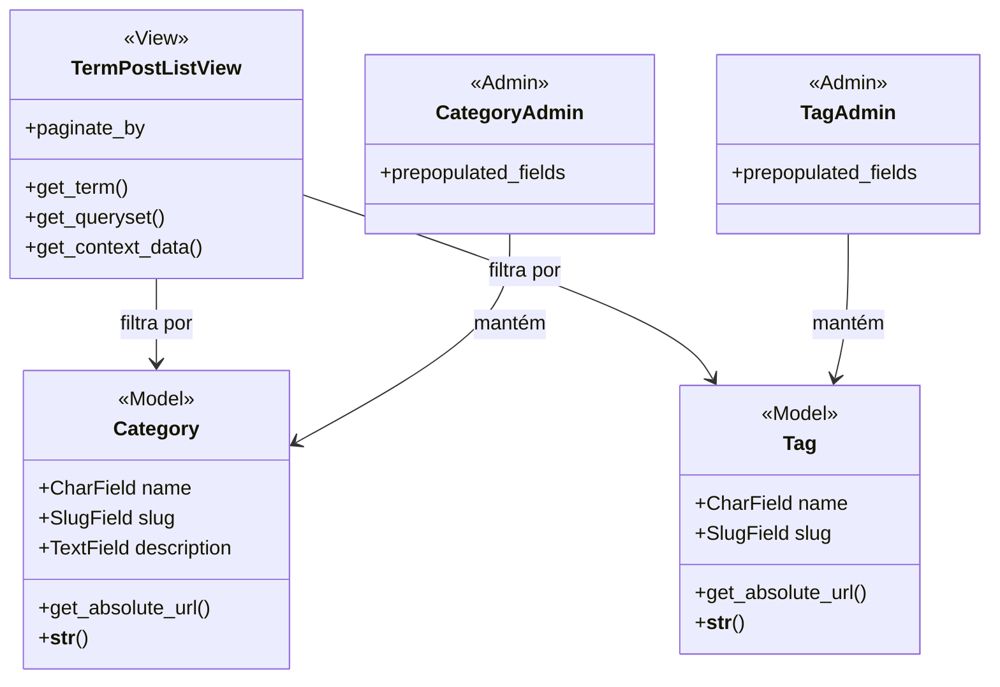

## taxonomy

**Figura 17 — Classes de projeto de taxonomy**

Categoria e tag são modelos separados porque as regras diferem: a categoria é
obrigatória e única por texto, a tag é livre e acumulável, o que está em RN03.
As duas guardam `slug`, porque o endereço é por slug e não por número, que é
RN04.

`TermPostListView` atende os dois casos. `get_term()` resolve a categoria ou a
tag pelo slug, e devolve 404 quando o termo não existe. `get_queryset()`
consulta os textos publicados do termo, o que mantém rascunho fora da contagem
e da listagem, conforme RN05.

Manter taxonomia (UC12) é feito pelo admin. `prepopulated_fields` monta o slug a
partir do nome enquanto o moderador digita, o que evita slug inventado à mão.
