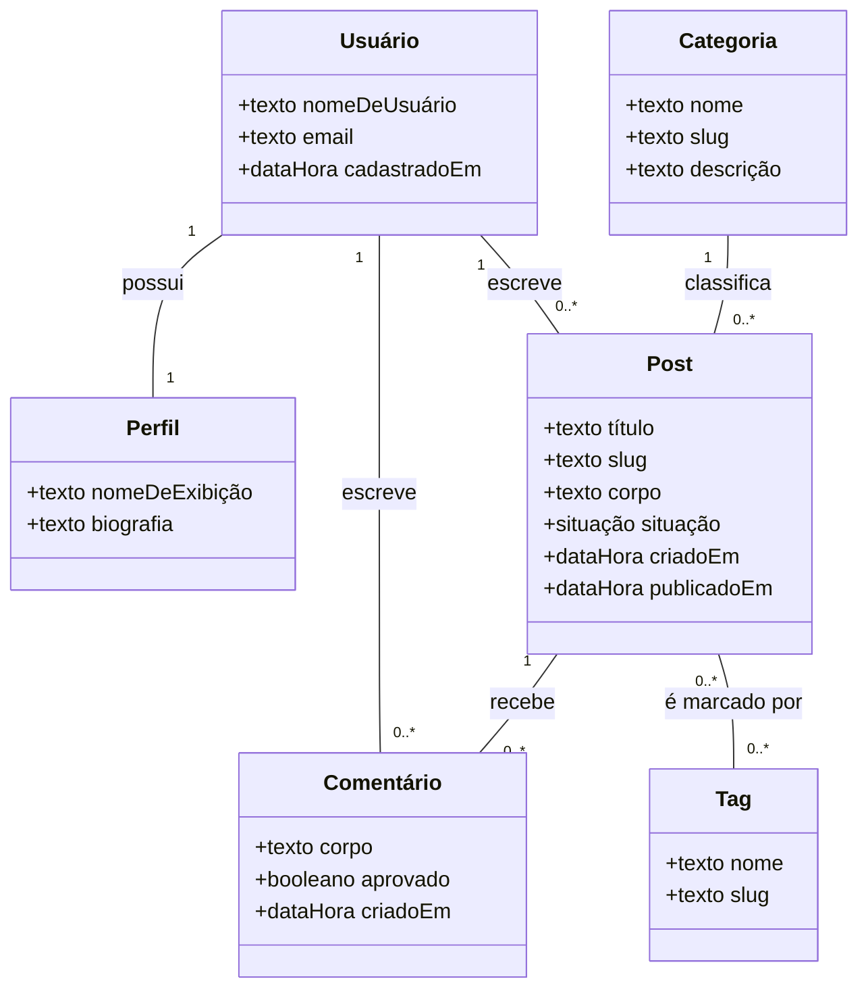
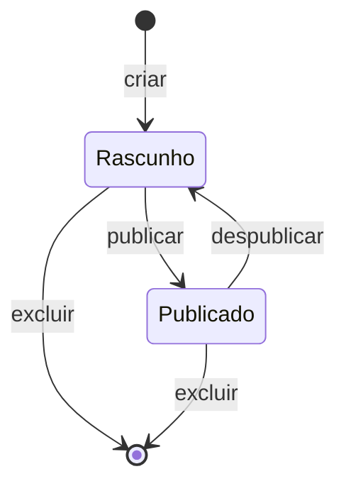

# Modelo de domínio

O modelo de domínio descreve os conceitos do blog e como eles se relacionam,
antes de qualquer decisão de implementação. Não há aqui classe de tela, de
controle nem de acesso a banco: está registrado apenas o que existiria de
qualquer forma, mesmo que o sistema fosse construído com outra tecnologia.

## Conceitos

**Tabela 13 — Conceitos do domínio**

| Conceito | Descrição |
| -------------- | ------------------------------------------------------- |
| Usuário | Pessoa cadastrada na plataforma, que escreve textos e comentários |
| Perfil | Informação pública de um usuário: nome de exibição e biografia |
| Post | Texto publicável, com título, endereço, corpo e situação |
| Comentário | Manifestação de um usuário sobre um post |
| Categoria | Assunto ao qual o post pertence, e ao qual pertence exatamente um |
| Tag | Marcador livre aplicado ao post, em qualquer quantidade |

Visitante não aparece como conceito porque não é registro: é a pessoa que lê
sem estar autenticada, e passa a existir no sistema quando se cadastra (UC05).

Papel também não é conceito à parte. Autor e moderador são o mesmo usuário com
permissões diferentes, e a distinção vive na autorização, não no domínio.

## Diagrama

**Figura 2 — Modelo de domínio**

## Associações

**Tabela 14 — Associações do domínio**

| Associação | Multiplicidade | Origem |
| ------------------------------ | ---------------- | ---------------------------------------- |
| Usuário possui Perfil | 1 para 1 | O perfil nasce junto com a conta, no passo 7 de UC05 |
| Usuário escreve Post | 1 para 0..* | Um post tem um único autor, registrado na criação |
| Usuário escreve Comentário | 1 para 0..* | RN13 e RN16: comentar exige conta, e o vínculo não muda |
| Categoria classifica Post | 1 para 0..* | RN03: o post pertence a exatamente uma categoria |
| Post recebe Comentário | 1 para 0..* | RN11: excluir o post exclui os comentários |
| Post é marcado por Tag | 0..* para 0..* | RN03: zero ou mais tags por post, e a tag serve a vários posts |

Categoria e tag existem pelo mesmo motivo, organizar o conteúdo, mas não são o
mesmo conceito. A categoria é obrigatória e única, define a seção do blog. A tag
é livre e acumulável, atravessa seções.

## Ciclo de vida do post

**Figura 3 — Ciclo de vida do post**

Todo post nasce rascunho (RN12), e só o autor o enxerga nesse estado (RN01). A
publicação é ato explícito, descrito em UC09, e é reversível.

O comentário tem ciclo mais simples, com dois valores de `aprovado`. Nasce
aprovado e visível, e a moderação o retira do ar (RN14). Não há estado
intermediário de espera, porque moderação prévia exigiria alguém de plantão para
que a discussão parecesse viva.

## O que o modelo não representa

Sessão, permissão, paginação e busca são comportamento do sistema, não conceito
do negócio. Aparecem nos casos de uso e nos diagramas de sequência, e não aqui.
