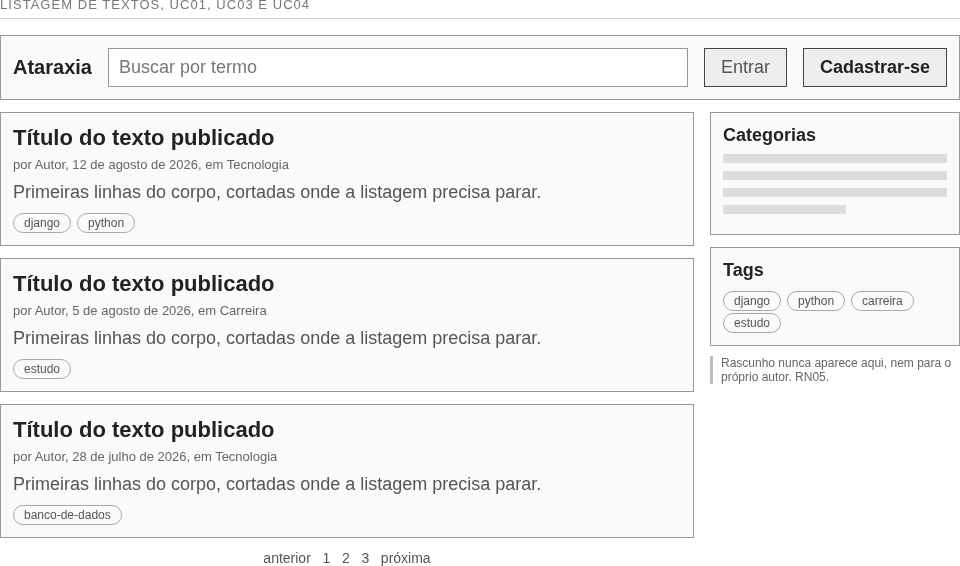
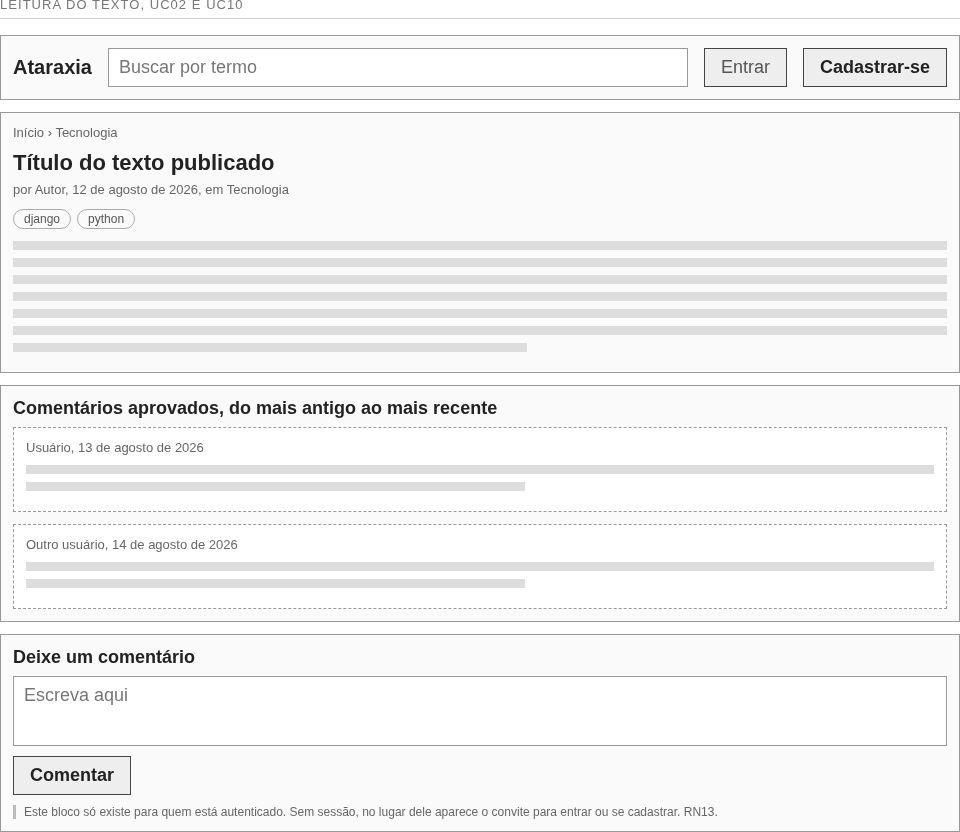
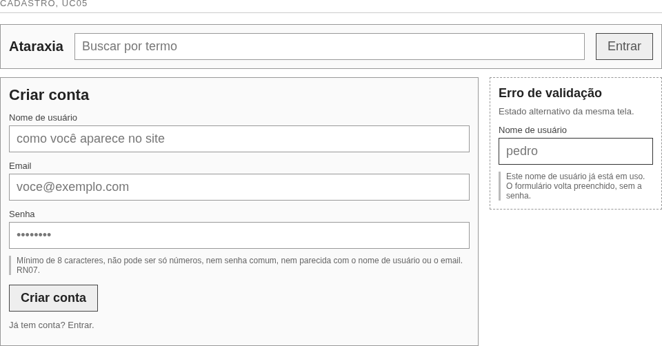
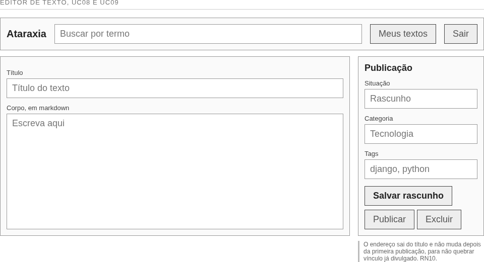
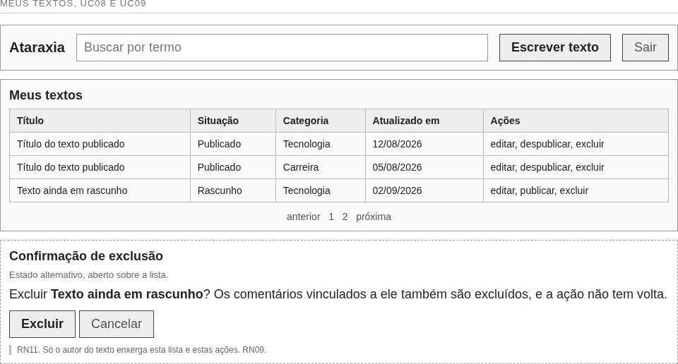

# Protótipos de tela

Os protótipos definem o que aparece em cada tela e onde, não a aparência final.
São wireframes: caixa, linha e rótulo, sem cor, sem logotipo e sem tipografia
definida. Layout, paleta e tipografia continuam em aberto, como registrado nas
decisões técnicas do projeto.

Cinco telas cobrem o caminho de visitante e o de autor.

**Tabela 16 — Telas e casos de uso atendidos**

| Tela | Casos de uso | Quem usa |
| -------------------------- | -------------------------- | ---------------------- |
| Listagem de textos | UC01, UC03, UC04 | Visitante |
| Leitura do texto | UC02, UC10 | Visitante e autor |
| Cadastro | UC05 | Visitante |
| Editor de texto | UC08, UC09 | Autor |
| Meus textos | UC08, UC09 | Autor |

Moderar comentário, manter taxonomia e gerenciar usuários (UC11, UC12 e UC13)
não têm protótipo porque são atendidos pelo admin do Django, decisão registrada
no capítulo de arquitetura. Desenhar tela para eles seria desenhar tela que não
vai ser construída.

A fonte de cada protótipo é o arquivo `.html` ao lado, e o `.png` é a exportação
que entra neste documento. Para alterar uma tela, edite o `.html` e rode
`./gerar.sh`.

## Listagem de textos

**Figura 9 — Protótipo da listagem de textos**

É a porta de entrada do site e a única tela que um visitante precisa ver para
usar o blog. Busca, categorias e tags ficam à vista, porque são os três modos de
chegar a um texto. A lateral repete o que a URL faz, e serve a quem navega sem
saber o endereço.

## Leitura do texto

**Figura 10 — Protótipo da leitura do texto**

O corpo do texto vem primeiro, os comentários aprovados em seguida e o
formulário por último. O bloco do formulário só existe para quem está
autenticado; sem sessão, o mesmo espaço recebe o convite para entrar ou se
cadastrar.

## Cadastro

**Figura 11 — Protótipo do cadastro**

As regras de senha aparecem antes de o visitante digitar, e não depois de o
sistema recusar. À direita está o estado alternativo da mesma tela, com o campo
em conflito destacado e o formulário devolvido preenchido, sem a senha.

## Editor de texto

**Figura 12 — Protótipo do editor de texto**

Título e corpo ocupam a maior parte da tela, e o que é decisão de publicação
fica na coluna da direita, separado da escrita. Salvar rascunho e publicar são
botões distintos porque são atos distintos: todo texto nasce rascunho, e a
publicação é explícita.

## Meus textos

**Figura 13 — Protótipo da lista de textos do autor**

A situação de cada texto é coluna, e não ícone, para que rascunho e publicado se
distingam sem legenda. A confirmação de exclusão avisa que os comentários
vinculados vão junto e que a ação não tem volta.
