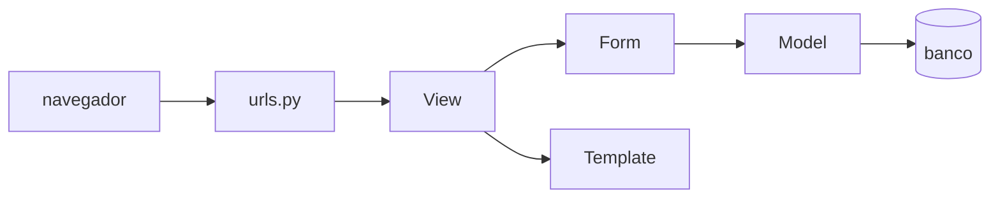

# Diagramas de sequência de projeto

Os diagramas de sequência de sistema mostram o que o usuário pede e o que o
sistema responde, com o sistema fechado numa caixa só. Aqui a caixa é aberta: os
mesmos fluxos aparecem com as classes que vão executá-los, na ordem em que
trocam mensagem.

Os participantes seguem sempre o mesmo caminho, que é o do Django:

**Figura 20 — Caminho de uma requisição**

O roteamento não ganha raia própria nos diagramas: ele aparece no endereço da
primeira mensagem, que é o que o `urls.py` resolve. Categoria, tag e texto são
resolvidos por slug, e é por isso que o endereço vale como desenho.

Cinco diagramas, um por caso de uso principal, na mesma ordem do capítulo de
casos de uso.
