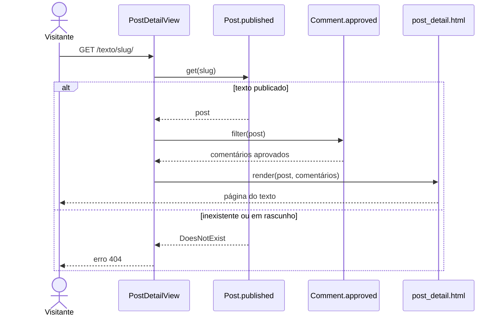

## UC02 — Ler post

**Figura 21 — Sequência de projeto do UC02**

A view consulta `Post.published`, e não o gerenciador padrão. É por isso que
rascunho e endereço inexistente terminam no mesmo 404 sem que a view escreva uma
condição para cada caso, o que atende RN01.

O formulário de comentário é montado pelo template, e só quando há sessão. A
view não decide isso.
