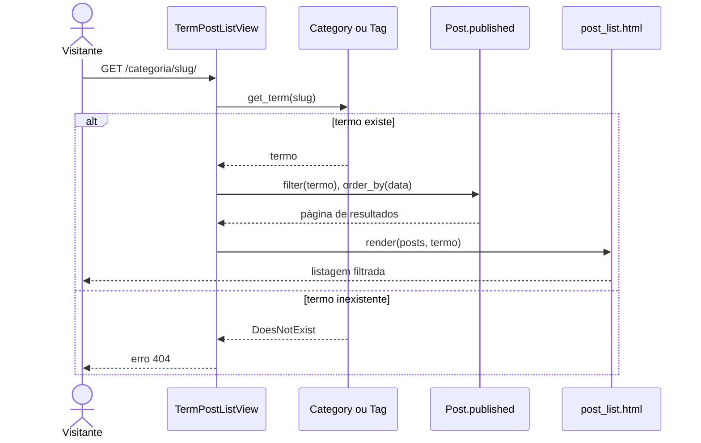

## UC04 — Filtrar por categoria ou tag

**Figura 22 — Sequência de projeto do UC04**

O mesmo par de view e template atende categoria e tag. O que muda é a rota em
`urls.py`, que diz qual modelo `get_term()` deve consultar, e o resto do caminho
é idêntico.

A consulta sai de `Post.published`, o que mantém rascunho fora da listagem e da
contagem, conforme RN05.
