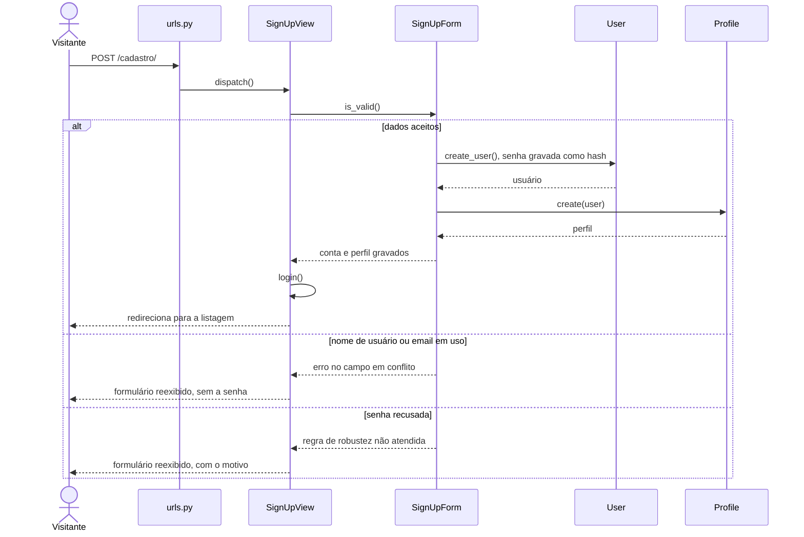

## UC05 — Cadastrar-se

**Figura 23 — Sequência de projeto do UC05**

Conta e perfil são criados na mesma passagem pelo formulário, e é o que impede
usuário sem perfil. A senha nunca transita como texto puro para o modelo:
`create_user()` já grava o hash, o que é RN06.
