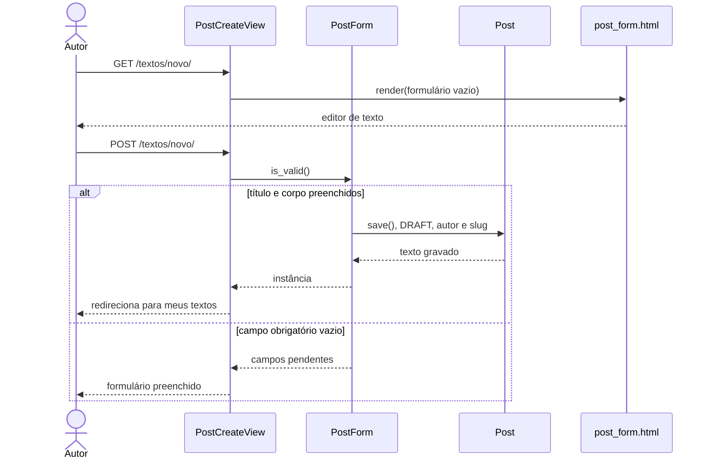

## UC08 — Manter post

**Figura 24 — Sequência de projeto do UC08**

Alterar e excluir percorrem o mesmo caminho, trocando a view por
`PostUpdateView` ou `PostDeleteView`. As duas chamam `test_func()` antes de
qualquer gravação, e é aí que mora RN09: texto de outro autor termina em 403,
mesmo que o endereço seja digitado à mão.

O slug é gerado no `save()` do formulário e ganha sufixo numérico quando já
existe outro igual. Depois da primeira publicação ele não muda mais, conforme
RN10.
