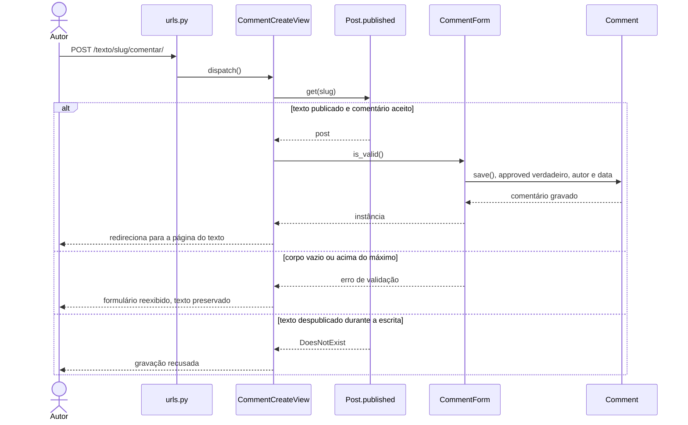

## UC10 — Comentar post

**Figura 22 — Sequência de projeto do UC10**

A view confirma que o texto continua publicado antes de gravar, e não apenas na
hora de exibir o formulário. Sem isso, um texto despublicado enquanto alguém
escreve receberia comentário.

O autor do comentário vem da sessão, nunca do formulário, o que atende RN16.
