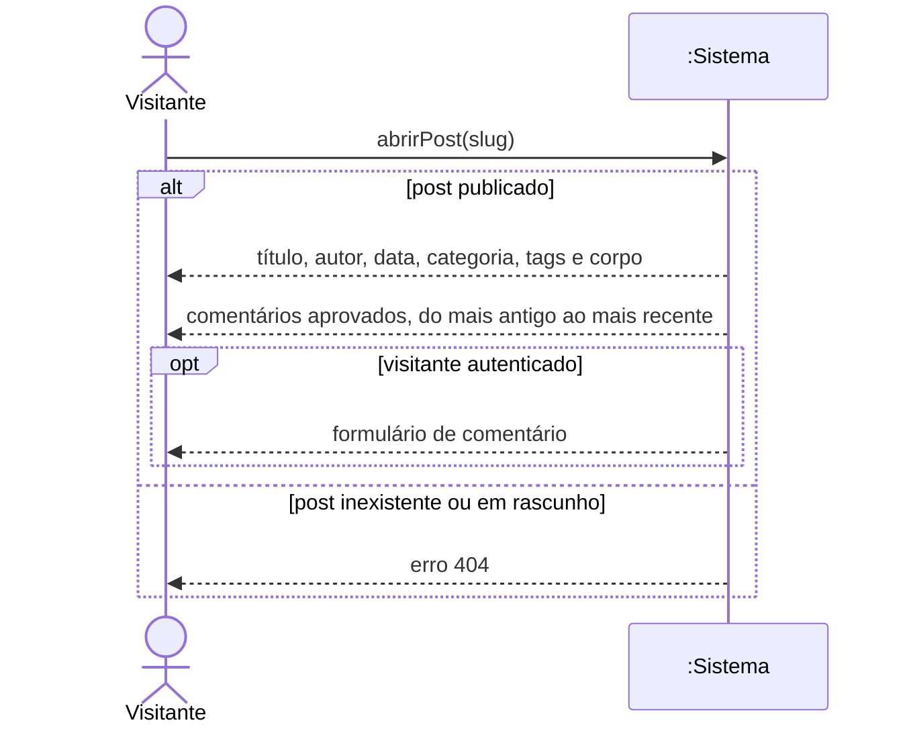
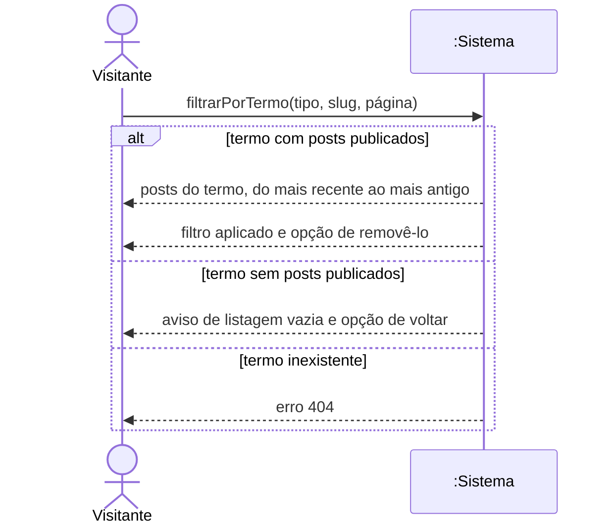
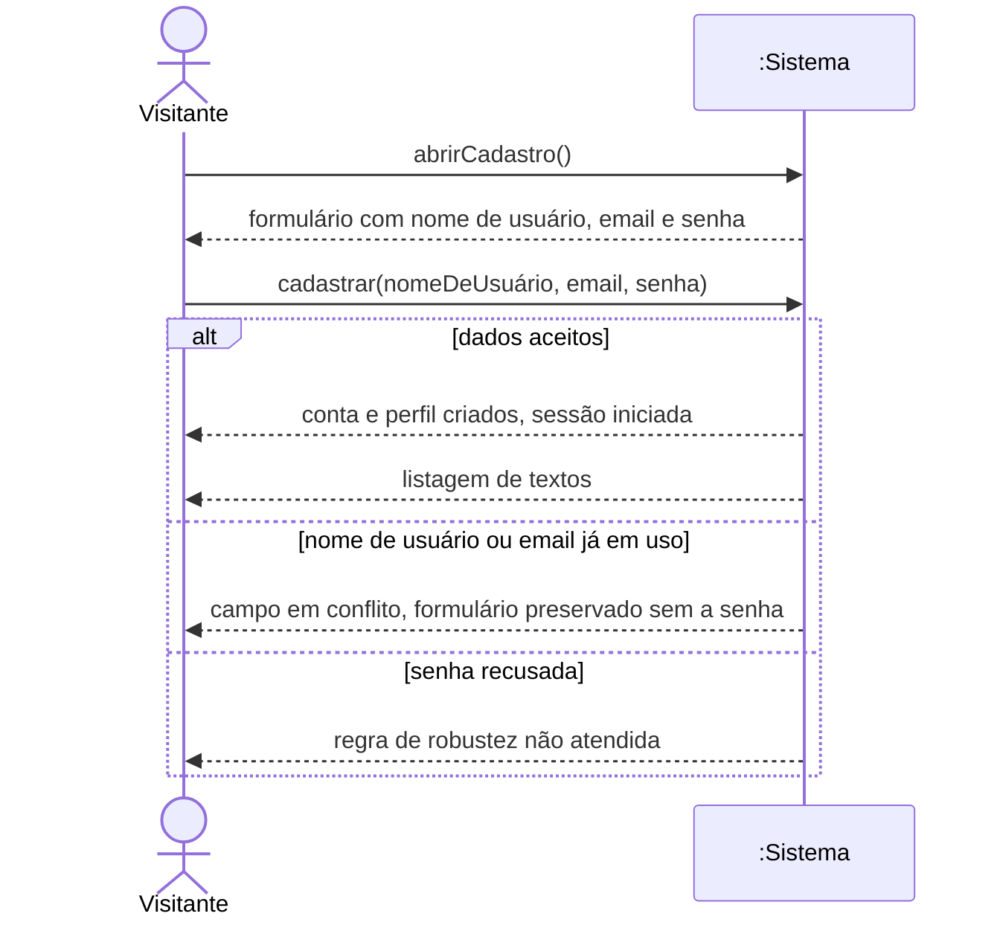
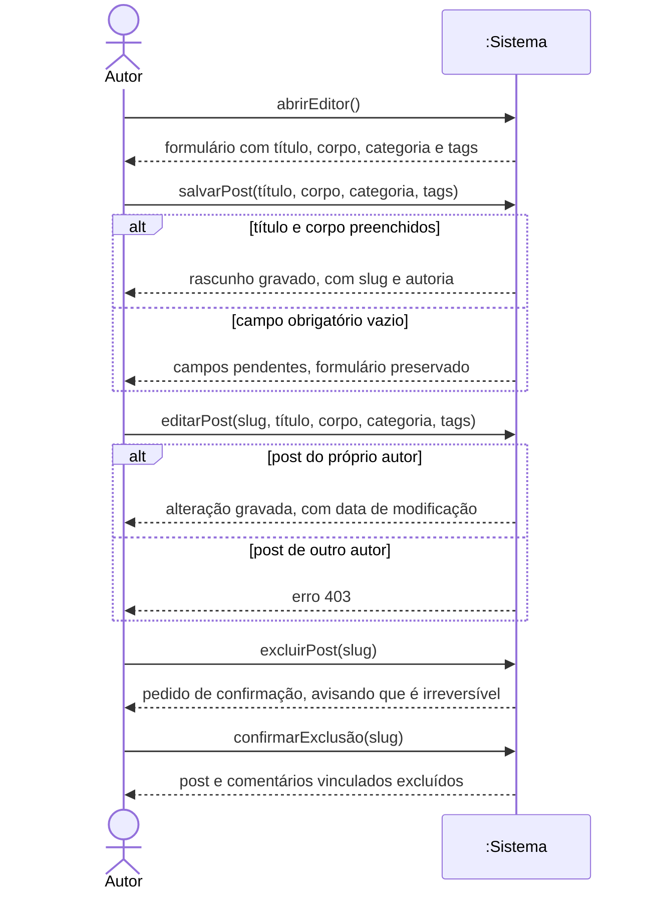
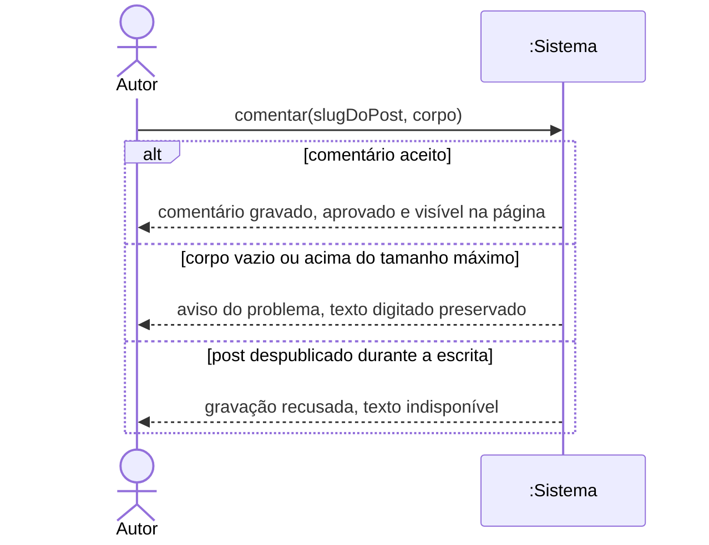

# Diagramas de sequência de sistema

Cada diagrama mostra um caso de uso principal com o sistema tratado como caixa
preta: aparecem os eventos que o ator dispara, na ordem em que acontecem, e as
respostas devolvidas. Como o sistema é uma peça só, não há aqui divisão em
telas, views ou modelos. Essa divisão está no capítulo de diagramas de sequência
de projeto.

As operações abaixo são a fronteira do sistema. O que existir fora dessa lista
não é acionável pelo usuário nos casos de uso principais. Quem dispara cada uma
é o ator do caso de uso correspondente: visitante em UC02, UC04 e UC05, autor em
UC08 e UC10.

**Tabela 15 — Operações de sistema**

| Operação | Parâmetros | Caso de uso | Resposta |
| ------------------------------ | -------------------------- | ------------ | -------------------------------- |
| `abrirPost` | slug do texto | UC02 | Post publicado com os comentários aprovados, ou erro 404 |
| `filtrarPorTermo` | tipo do termo, slug, página | UC04 | Listagem restrita ao termo, ou erro 404 |
| `abrirCadastro` | nenhum | UC05 | Formulário de cadastro |
| `cadastrar` | nome de usuário, email, senha | UC05 | Conta criada e sessão iniciada, ou erro de validação |
| `abrirEditor` | nenhum | UC08 | Formulário de texto |
| `salvarPost` | título, corpo, categoria, tags | UC08 | Rascunho gravado, ou campos pendentes |
| `editarPost` | slug e os campos do texto | UC08 | Alteração gravada, ou erro 403 |
| `excluirPost` | slug | UC08 | Pedido de confirmação |
| `confirmarExclusão` | slug | UC08 | Post e comentários excluídos |
| `comentar` | slug do post, corpo | UC10 | Comentário gravado e visível, ou aviso do problema |

## UC02 — Ler post

**Figura 4 — Sequência de sistema do UC02**

O rascunho e o endereço inexistente produzem a mesma resposta, e é o que RN01
exige: um 403 confirmaria que o texto existe.

## UC04 — Filtrar por categoria ou tag

**Figura 5 — Sequência de sistema do UC04**

O parâmetro `tipo` distingue categoria de tag. A operação é a mesma porque o
comportamento é o mesmo: restringir a listagem a um termo e permitir desfazer.

## UC05 — Cadastrar-se

**Figura 6 — Sequência de sistema do UC05**

## UC08 — Manter post

**Figura 7 — Sequência de sistema do UC08**

Criar, alterar e excluir estão no mesmo diagrama porque são o mesmo caso de uso.
As três operações são independentes entre si, e a ordem em que aparecem é a de
leitura, não uma sequência obrigatória.

## UC10 — Comentar post

**Figura 8 — Sequência de sistema do UC10**

O visitante não autenticado não aparece no diagrama porque não chega a disparar
a operação: sem sessão, o sistema exibe o convite para entrar no lugar do
formulário, como descrito em UC02.
